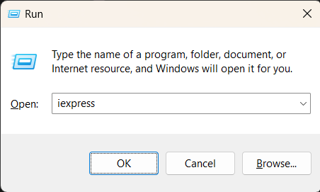
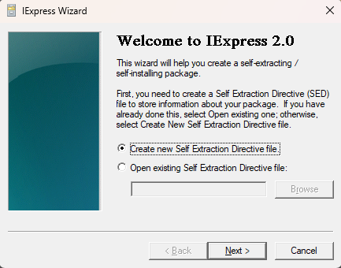
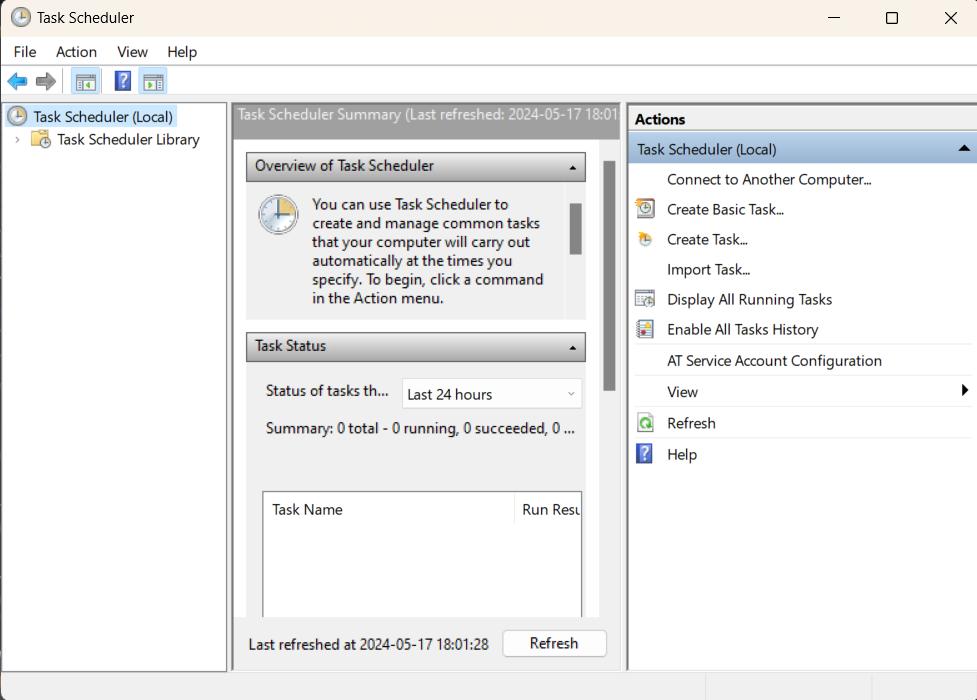
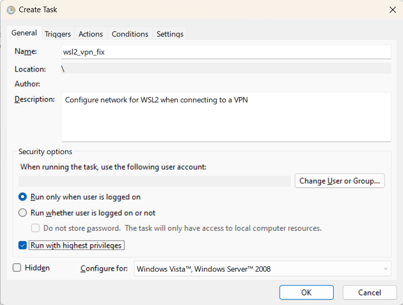
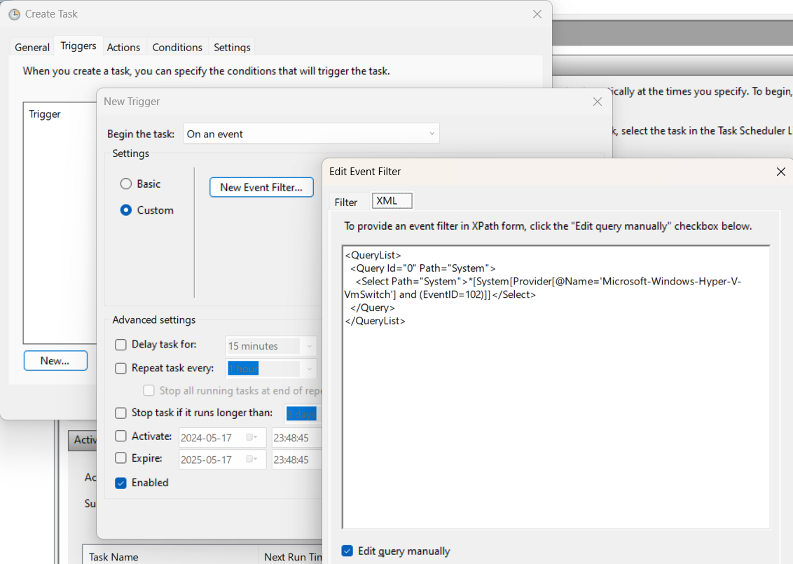
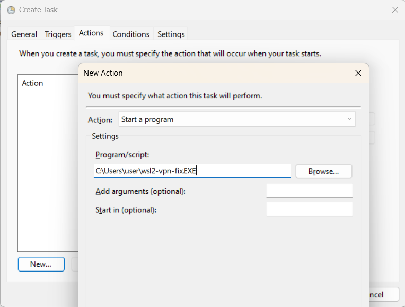
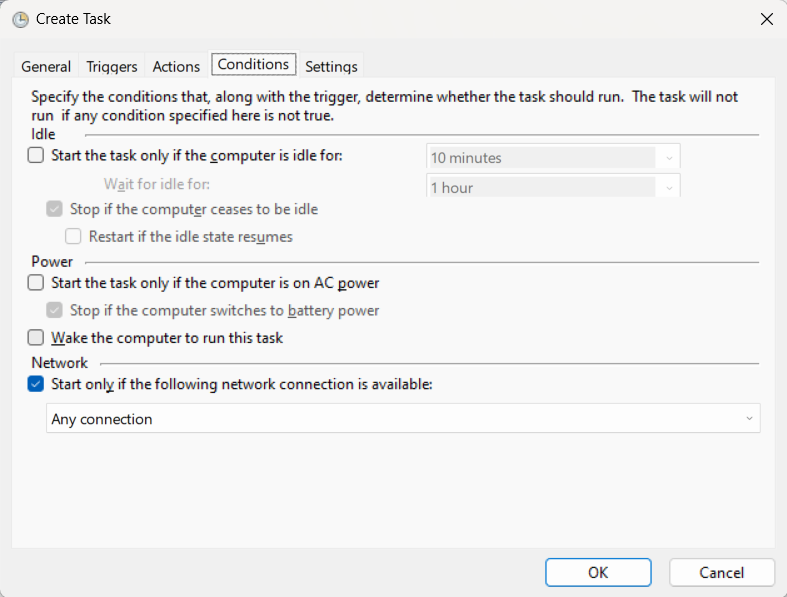
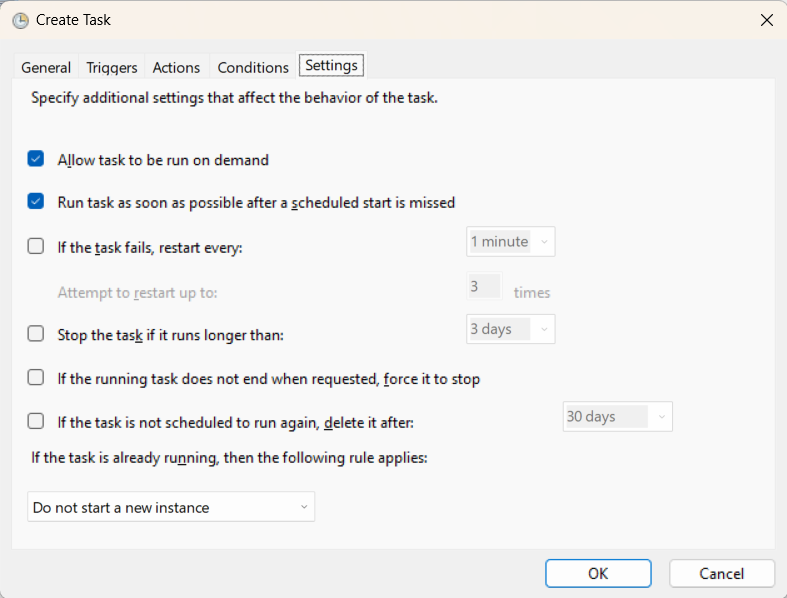

# WSL2 Fix for VPN

## About

Steps to resolve network issues for WSL2 when connected to some corporate 
VPNs.


## Contents

- [Usage](#usage)
    - [Converting ps1 to exe](#converting-ps1-to-exe)
    - [Adding a scheduled task](#adding-a-scheduled-task)


## Usage

The included PowerShell script can be run as a standalone file or set to run 
on VPN startup using Windows Task Scheduler. 

You may need to convert the PowerShell script to an `*.exe` file for it to run
properly as an action in Task Scheduler.


### Converting ps1 to exe

1. Download the included `*.ps1` file
2. Press `win+r` to open the Run dialogue box.  
   
3. Enter "iexpress".  
   
4. Select "Create new Self Extraction Directive file" and click next.
5. Select "Extract files and run an installation command" and click next.
6. Provide a package title (eg "WSL2 Net Fix") and click next.
7. Select "No prompt" at the following screen and click next.
8. Select "Do not display a license" on the and click next.
9. Click add and open the path to the downloaded PowerShell script, then click 
   next.
10. In the "Install Program" box enter the following, where `<file>` is the 
    base file name from step 9.
    ```ps1
    powershell.exe -ExecutionPolicy Bypass -File <file>`
    ```
12. On the next page, select "Hidden" and click next.
13. Select "No message" and click next.
14. Enter a path to save the new exe and click next.
15. Select "No restart" and click next.
16. Select "Don't save" and click next. 
17. Click next and finish to complete.


### Adding a scheduled task

1. From the Windows Start menu, open Task Scheduler.  
   
2. From the right pane, click "Create Task".
3. General.  
   
    - Set Name (eg "wsl_vpn_fix").
    - Add description (eg "Configure network for WSL2 when connecting to a 
      VPN").
    - Set user account to run as.
    - Select "Run only when user is logged on".
    - Select "Run with highest privileges".
    - Leave all other settings as default.
4. Triggers.  
   
    - Next to Begin the task, select "On an event" from the drop-down.
    - Select "Custom" and click "Edit Event Filter"
    - Select "Edit query manually" and enter the following as XML:
      ```xml
      <QueryList>
      <Query Id="0" Path="System">
      <Select Path="System">*[System[Provider[@Name='Microsoft-Windows-Hyper-V-VmSwitch'] and (EventID=102)]]</Select>
      </Query>
      </QueryList>
      ```
    - **Important: Close and re-open the event filter to make sure the XML 
      saved properly**
    - Leave all other settings as default.
5. Actions.  
   
    - Click New and select "Start a Program" from the Action drop-down.
    - Browse to the exe file from the previous section to use as the 
      program/script to run.
6. Conditions.  
   
    - Click "Start only if the following network condition is available" and 
      select "Any connection".
    - Uncheck all other unrelated actions.
7. Settings.  
   
    - Select "Allow task to be run on demand".
    - Select "Run task as soon as possible after a scheduled start is missed".
    - Leave all other settings as default or unchecked.

Once complete, the network routing for WSL2 will be automatically updated for 
any new VPN connections.

