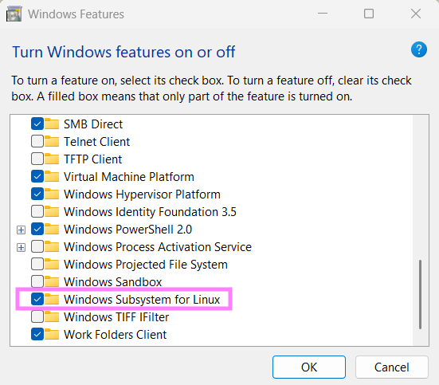

# WSL Setup

## Contents

- [About](#about)
- [Installing WSL2](#installing-wsl2)
- [Custom distributions](#Custom-distributions)
    - [Preparing a Stage3 tarball](#preparing-a-stage3-tarball)
    - [Preparing a Stage3 tarball](#preparing-a-stage3-tarball)

## About

WSL setup guide for new installations.

## Prerequisites

- Basic familiarity with running PowerShell and Bash commands.
- [7zip file archiver](https://7-zip.org/download.html)

## Installing WSL2

1. Start Menu > "Turn Windows features on or off" > Windows Subsystem for Linux  
   
    - You'll be prompted to restart to update. Complete before continuing.
2. `wsl --install`
3. `wsl -l -v`
    - Confirm the version is WSL2. If not, run  
      `wsl --set-default-version <Version#>`
    - If this fails to update and mentioned an unsupported kernel  
      package, download and install the [WSL2 Linux kernel update  
      package for x64 machines](https://wslstorestorage.blob.core.windows.net/wslblob/wsl_update_x64.msi)

## Custom distributions

Custom WSL installations can be made by simply importing a `.tar` file  
containing the root filesystem of your target distribution. Many custom  
distribution can be installed this way by using a virtual machine to  
create the `.tar` archive of a newly installed Linux distribution.  

Other distros such as Gentoo and Void Linux provide initial rootfs or  
stage files officially. In this example, Gentoo Linux will be used  
to demonstrate installing a custom distro

### Preparing a Stage3 tarball

1. Download the stage3 tarball.
    - [latest Current stage4 amd64 nomultilib openrc](https://distfiles.gentoo.org/releases/amd64/autobuilds/current-stage3-amd64-nomultilib-openrc/)
    - Stage3 is used to ensure compatibility by forcing the  
      installation to be 64-bit only.
2. Download the corresponding `.sha256` file.
    - This should be signed by the "Gentoo Linux Release Engineering  
      (Automated Weekly Release Key)" key from the [Signatures page](https://www.gentoo.org/downloads/signatures/).
    - If you're in a Linux environment now, fetch the key and verify  
      the `.sha256` file with `gpg --verify *.sha256`.
    - For new installs, verifying the hash is usually sufficient and the  
      signature can be verified after installing.
3. Get the SHA256 hash of the downloaded tarball and compare with the  
   hash inside the `.sha256` file to verify the file integrity. These  
   should match.
    - Windows: `Get-FileHash -A sha256 *tar.xz`.
    - Linux: `sha256sum *tar.xz`.
